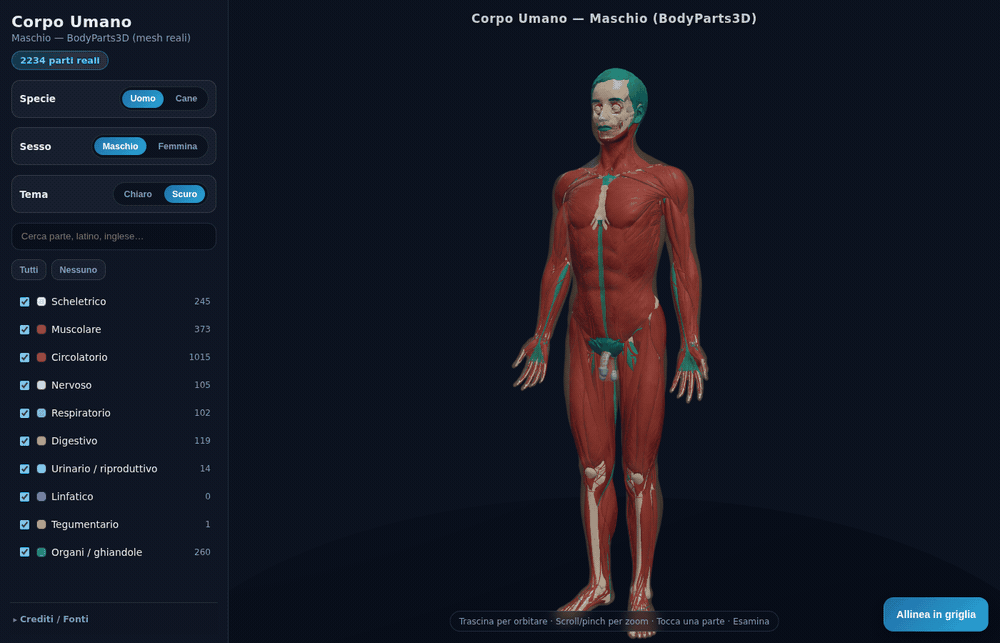
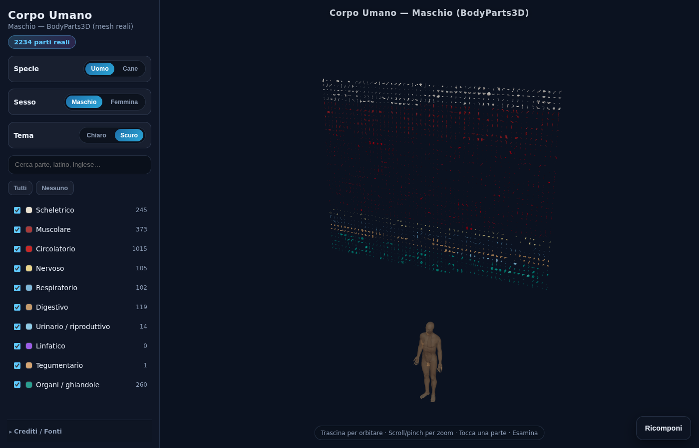
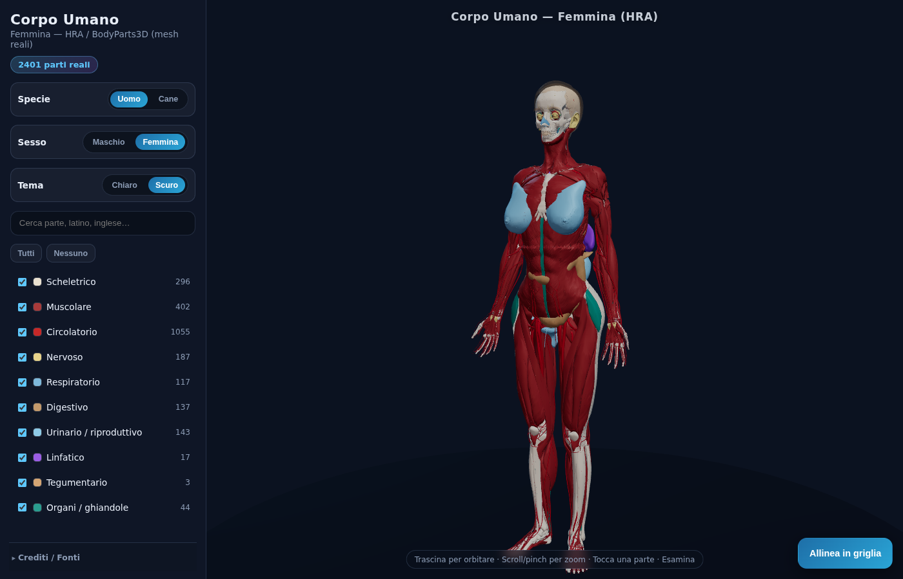
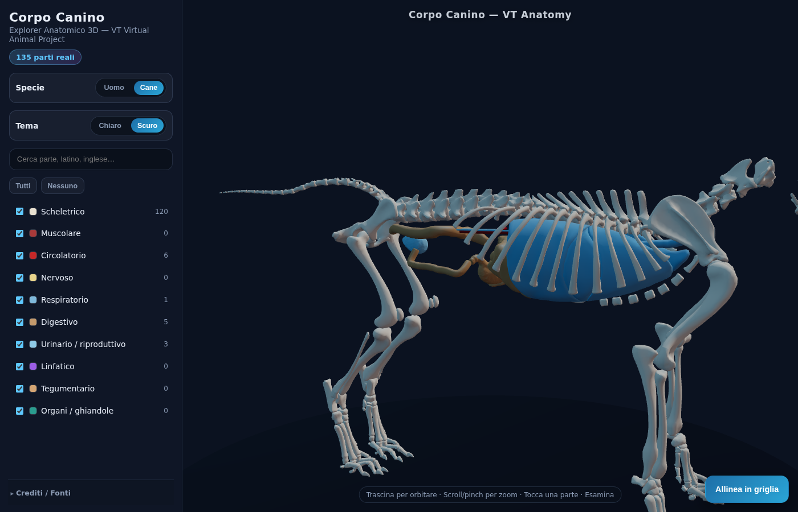

# Corpo Umano

Explorer anatomico 3D multi-specie: esplora **oltre 2.200 parti** reali del corpo umano (e uno scheletro canino), con filtri per sistema, griglia allineata e modalità Esamina.

[**▶ Apri la demo live**](https://njcki.github.io/corpo-umano/) · [Repository](https://github.com/Njcki/corpo-umano)

## Funzionalità

- **2.234+ mesh BodyParts3D** (Maschio) — scheletro, muscoli, vasi, nervi, organi…
- **Maschio / Femmina / Cane** — cataloghi distinti, stessi strumenti di esplorazione
- **Filtri per sistema** e ricerca per nome (IT / latino / EN)
- **Allinea in griglia** — sparpaglia le parti visibili in una griglia ordinata, poi ricomponi
- **Esamina** — focus su una parte *Nel corpo* o *Solo questo*
- **Tema chiaro / scuro** e UI pensata anche per **mobile** (touch, pinch, FAB)

## Demo live

**https://njcki.github.io/corpo-umano/**

## Schermate

| Maschio assemblato | Griglia allineata |
|:---:|:---:|
|  |  |

| Femmina (HRA) | Cane (VT) |
|:---:|:---:|
|  |  |

## Come eseguirlo in locale

Serve Node.js 18+.

    npm i
    npm run dev
    npm run build

Dev: http://localhost:5173/corpo-umano/
Build: dist/ (base /corpo-umano/ for Pages).
Preview: npm run preview

## Nota onesta

È una **visualizzazione educativa**, non un atlante clinico.

- **Femmina**: mesh HRA + BodyParts3D; **senza cute full-body** (solo dettagli tegumentari minori).
- **Cane**: modello VT prevalentemente **scheletrico**, con pochi organi/vasi.
- Alcuni sistemi (es. linfatico sul Maschio IS-A) possono essere assenti o incompleti a seconda del dataset.

## Crediti e licenze

| Catalogo | Fonte | Licenza |
| --- | --- | --- |
| **Maschio** | [BodyParts3D](https://dbcls.rois.ac.jp/index-en.html) / DBCLS (IS-A 4.0) | **CC BY-SA 2.1 JP** |
| **Femmina** | [Human Reference Atlas](https://humanatlas.io/) (HuBMAP) + BodyParts3D | **CC BY 4.0** + CC BY-SA 2.1 JP |
| **Cane** | Virginia Tech Virtual Animal Project (ARIES / VT Canine) | **CC BY-NC-SA 4.0** |

BodyParts3D © The Database Center for Life Science.
Il codice del viewer è su [GitHub](https://github.com/Njcki/corpo-umano); le mesh restano sotto le rispettive licenze dei dataset.

---

Pagine del progetto: **https://njcki.github.io/corpo-umano/**

